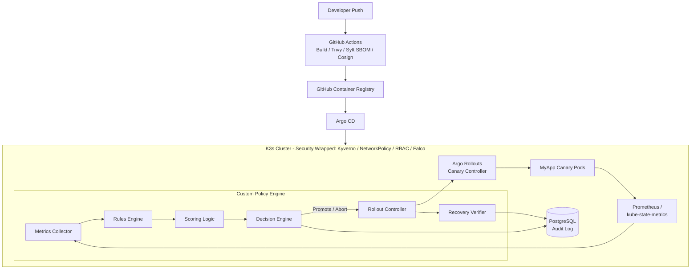

# Zero-Downtime Kubernetes Canary Platform: Final Report

## 1. Project Overview

This project implements a GitOps-driven canary deployment pipeline featuring a custom, fully automated policy-engine decision loop for promote, hold, and rollback operations. Wrapping this deployment pipeline is a rigorous supply-chain and runtime security hardening layer, ensuring that only verified artifacts run within a least-privilege, segmented environment. The system was built from scratch to push beyond standard coursework and build deep, practical expertise in modern DevOps, infrastructure-as-code, advanced Kubernetes traffic management, automated telemetry-driven decision making, and cloud-native security.

## 2. Architecture Diagram



## 3. Tech Stack

| Technology | Purpose |
| :--- | :--- |
| **FastAPI (Python)** | Core framework for building the custom Policy Engine and test applications. |
| **Docker** | Containerization of the application and policy engine components. |
| **K3s** | Lightweight, production-grade Kubernetes cluster (running on Proxmox VMs). |
| **GitHub Actions** | CI pipeline for building, testing, securing, and pushing images. |
| **Trivy** | Container vulnerability scanning in the CI pipeline. |
| **Syft** | Software Bill of Materials (SBOM) generation for supply chain transparency. |
| **Cosign** | Keyless OIDC signature generation and signing of container images. |
| **Argo CD** | GitOps continuous delivery tool ensuring cluster state matches the git repository. |
| **Argo Rollouts** | Advanced deployment controller enabling progressive canary rollouts. |
| **Prometheus** | Time-series database scraping and storing application and cluster metrics. |
| **kube-state-metrics** | Exposing cluster-level resources (like pods, deployments) as Prometheus metrics. |
| **Grafana** | Visualization dashboard for telemetry and system health. |
| **PostgreSQL** | Relational database acting as the immutable audit log for policy decisions. |
| **Kyverno** | Kubernetes admission controller enforcing Cosign image signature verification. |
| **Falco** | Cloud-native runtime security threat detection using eBPF probes. |
| **Helm** | Used to install third-party infrastructure components (kube-prometheus-stack, Kyverno, and Falco). |
| **k6** | Load testing tool to generate realistic traffic and trigger failure scenarios. |

## 4. Core Contribution: The Policy Engine

The most significant technical contribution of this project is the **Automated Policy Engine**, a Python-based microservice that entirely removes human intervention from the canary evaluation process. 

1. **Watch Loop (`watch_loop.py`)**: The central polling orchestrator that drives the entire evaluation cycle, coordinating metric collection, rule evaluation, scoring, decision making, and triggering rollout actions or recovery verification at regular intervals.
2. **Metrics Collector (`collector.py`)**: Continuously polls Prometheus via PromQL to gather 5 core SLIs: Request Rate, Error Rate (%), P95 Latency, Ready Pods, and Pod Restarts (over a 5m window).
3. **Rules Engine (`rules.py`)**: Evaluates the collected metrics against a two-tier severity threshold system (warning and critical) per rule. It also implements consecutive-violations-required counting to filter out transient spikes before a rule officially counts as triggered.
4. **Scoring Logic (`scoring.py`)**: Aggregates the rule evaluations into a numerical score (0-100) using a weighted penalty model (e.g., critical = -40, warning = -15). 
5. **Decision Engine (`decision_engine.py`)**: A pure classification-to-action mapping component that translates the numerical score into a discrete action. A score >= 80 implies health (`promote`), 50-79 triggers a `hold` (wait and see), and < 50 triggers an immediate `rollback`.
6. **Rollout Controller (`rollout_controller.py`)**: Translates the decision into Kubernetes API calls (using the `kubectl-argo-rollouts` binary under the hood). It patches the Argo Rollout custom resource to either `promote` to the next step, or `abort` to instantly route 100% of traffic back to the stable version.
7. **Recovery Verifier (`recovery_verifier.py`)**: An asynchronous loop that tracks aborted deployments to ensure the system stabilizes (metrics return to green) *after* a rollback. It writes the final recovery time to the audit database.

## 5. Key Engineering Findings

Throughout the development and rigorous testing phases, several non-obvious engineering challenges were uncovered and solved:

- **The Grace-Period Fix for Pod-Churn False Positives (Phase 9):**
  Initially, the policy engine aggressively rolled back healthy canaries. During a rollout step, new pods take time to initialize, leading to temporary dips in traffic or transient connection resets. A `grace_period` (20 seconds) was implemented immediately after a canary step weight increase, pausing metric evaluation until the new pods stabilized.
- **The Fault-Injection Isolation Bug (Phase 10b):**
  We originally used a shared `ConfigMap` to inject failures (e.g., latency spikes) into the canary pod. However, updating the ConfigMap inadvertently affected the stable pods as well, completely breaking canary isolation semantics. The fix was to bake the failure mode directly into the container image using specific tags (e.g., `:bad-canary`), ensuring isolation at the artifact level.
- **Metric-Aggregation-Window vs. Recovery-Timeout Mismatch (Phase 12):**
  During recovery verification, we discovered a mismatch between PromQL aggregation windows. The `error_rate` used a 1-minute window, allowing it to clear quickly post-rollback. However, `p95_latency` used a 5-minute sliding window (`[5m]`). After rolling back a slow canary, the bad latency data lingered in Prometheus's 5-minute bucket, causing the Recovery Verifier to time out and fail. The fix was dynamically extending the verifier's timeout (up to 360s) to exceed the longest aggregation window of the violated metric.
- **Falco eBPF Driver Limitation on Kernel 6.8.0 (Phase 13c):**
  While configuring runtime threat detection, we discovered that Falco's `modern_ebpf` probe silently fails to hook the `execve` syscall for TTY shells on the specific Ubuntu 24.04 kernel (`6.8.0-138-generic`). It successfully hooks `connect` syscalls (catching unauthorized API server access), proving the pipeline works, but the shell-detection gap remains a documented limitation of the specific kernel/driver combination.

## 6. Evaluation Results

The system was evaluated against four distinct scenarios under sustained load generated by k6.

| Scenario | Description | Peak Error Rate | Peak p95 Latency | Time to Detect | Time to Recover |
| :--- | :--- | :--- | :--- | :--- | :--- |
| **A: Baseline** | Deploy a healthy version 100% immediately (no canary). | 0% | ~5ms | N/A | N/A |
| **B: Healthy Canary** | Deploy a healthy version incrementally (10% -> 25% -> 50% -> 90%). | 0% | ~5ms | N/A | N/A |
| **C: Bad Canary** | Deploy an image failing 50% of requests instantly. | 37.4% | ~5ms | ~3m | 66s |
| **D: Noisy Canary** | Deploy an image failing 20% of requests and latency spikes. | ~17.1% | ~2244ms | ~2m | 276s |

**Conclusion:** The results demonstrate that the automated policy engine successfully reduces the blast radius of a bad deployment. Instead of 100% of users experiencing a 50% failure rate (Baseline A), the failure is constrained to the canary group, and the system automatically detects, aborts, and recovers to a healthy state without any human intervention. 

## 7. Security Hardening Summary

The final phase wrapped the entire pipeline in a robust security layer:
- **Supply Chain:** GitHub Actions automatically scans code with Trivy, generates a Syft SBOM, and signs the image using Cosign (Keyless OIDC). 
- **Admission Control (Kyverno):** Enforced a cluster-level policy verifying Cosign signatures. Unsigned or tampered images are actively rejected by the Kubernetes API server at admission time:
  ```text
  Error from server: admission webhook "mutate.kyverno.svc-fail" denied the request: 

  resource Pod/zero-downtime/test-unsigned was blocked due to the following policies 

  verify-image-signature:
    verify-signature: 'failed to verify image docker.io/nginx:latest: .attestors[0].entries[0].keyless: no signatures found'
  ```
- **Network Segmentation:** Applied a `default-deny` NetworkPolicy. Traffic is strictly whitelisted via `allow-myapp` and `allow-postgres`. A specific gotcha encountered and solved was ensuring the `NetworkPolicy` explicitly allowed cross-namespace ingress from the `monitoring` namespace so Prometheus could scrape metrics.
- **Least-Privilege RBAC:** The policy engine's least-privilege permissions are defined via a dedicated ServiceAccount, scoped strictly to the `zero-downtime` namespace with granular permissions (get/list/watch, patch) exclusively on Rollout resources. While applied to the cluster, they are not yet bound to the running policy engine process, which currently still runs locally under the developer's kubeconfig.
- **Runtime Detection (Falco):** Deployed Falco to monitor anomalous container behavior. Despite the eBPF kernel limitation on shell execution, it successfully detects unauthorized outbound connections to the Kubernetes API.

## 8. Limitations & Future Work

While highly functional, the system has several known limitations that define clear paths for future work:
- **Hardcoded & Single-App Focus:** The policy engine is currently tightly coupled to `myapp` and hardcoded Prometheus queries. **Future Work:** Generalize the engine into a platform service that dynamically reads SLIs and thresholds from Custom Resource Definitions (CRDs) deployed alongside any application.
- **Lack of Active Notifications:** Rollbacks are logged to Postgres, but the team is not actively alerted. **Future Work:** Integrate a Slack or PagerDuty webhook trigger within the Decision Engine.
- **Kafka Event Pipeline (Skipped):** A planned Kafka-based event streaming pipeline for audit logs was marked optional and skipped to prioritize deep security hardening (Phase 13) and evaluation rigor.
- **Falco Kernel Incompatibility:** The eBPF gap on kernel 6.8.0. **Future Work:** Drop back to the legacy Kernel Module driver or upgrade Falco when a patch for this kernel tracepoint is released.

## 9. How to Reproduce

To rebuild this system from scratch:
1. **Infra Setup:** Provision a Kubernetes cluster (e.g., K3s) and deploy the standard Prometheus/Grafana stack and Argo CD.
2. **App & CI:** Build a FastAPI sample app with Prometheus instrumentation. Create a GitHub Action to build, scan (Trivy), generate SBOM (Syft), sign (Cosign), and push to GHCR.
3. **GitOps Bootstrapping:** Install Argo Rollouts in the cluster. Define the `myapp` Deployment as a `Rollout` resource in Git and sync it via Argo CD.
4. **Policy Engine Deployment:** Deploy a Postgres database for the audit log. Run the custom Python Policy Engine to continually poll Prometheus and patch the `Rollout` resource.
5. **Security Wrapping:** Install Kyverno and apply the Cosign signature verification ClusterPolicy. Apply `default-deny` NetworkPolicies and specific allow-lists. Install Falco for runtime threat detection.
6. **Execution:** Trigger a rollout by updating the image tag in Git. Use `k6` to generate traffic. Watch the Policy Engine automate the canary promotion or rollback based on telemetry.
